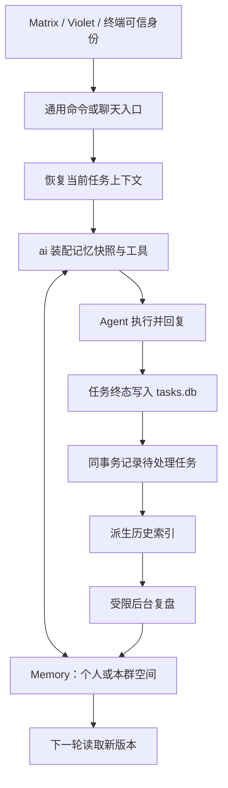

# Saber 长期记忆方案

状态：P1（可控跨会话记忆）、P2（可追溯历史回忆）、P3（自动形成长期记忆）与 P4（程序性经验与可复用技能）已实现。日期：2026-09-28。

用户已确定使用范围：**多人机器人，各用户独立记忆，群聊另有共享记忆**。本方案基于 Saber `5288b235dbd9a38f0908a084cbb334ae0a676cf8`；Hermes 的逐项研究与固定版本来源见 [研究记录](hermes-memory-research.md)。

## 1. 交付目标

完成以下行为，作为长期记忆首个完整版本的验收范围：

1. 用户在私聊里说“以后用中文简洁回答”，保存成功后，换会话、换模型、重启 Saber 都能继续使用这一偏好。
2. 其他用户不能读到这条个人记忆；同一用户在群里提问时，默认也不注入其私聊记忆。
3. 一个群可以维护“本群的发布流程、项目约定、已经确认的决定”，群成员共享，本群之外不可见。
4. 重要事实自动整理成小容量记忆；询问较久以前的细节时，按权限搜索历史，并给出来源。
5. 可以查看、修改、删除、暂停记忆；保存失败不能显示“已经记住”；后台整理的费用和结果可观察。

“跨会话”默认指同一平台、同一机器人账号下的同一用户。跨平台或跨机器人合并用户，需要以后显式绑定身份；用户名和显示名不作为绑定依据。

## 2. Hermes 的机制与 Saber 的取舍

Hermes 内置机制可以拆成四部分；外部记忆后端是另外的可选能力。

| Hermes 机制 | Saber 采用方式 |
| --- | --- |
| `MEMORY.md` 保存环境事实、经验，`USER.md` 保存用户偏好；默认容量分别为 2,200 和 1,375 字符 | 保留“事实/偏好”的内容分类，使用 SQLite 条目存储，并增加用户、群两类独立作用域 |
| 小容量记忆以快照进入模型上下文，模型通过工具增删改 | 每次用户发言对应的顶层任务读取一次快照，在该任务的工具循环中保持稳定；下一次发言读取新版本 |
| `session_search` 通过 SQLite FTS5 检索历史 | 对已有任务记录建立派生全文索引，返回原文片段、来源和后续读取游标 |
| 自动提醒和后台复盘维护记忆；skills 保存可复用步骤 | 先交付事实记忆与后台整理；程序性经验作为后续阶段 |

Hermes 的 home/profile 是记忆作用域，不能直接等同于多人机器人的用户隔离。Saber 不使用一份所有用户共用的 `USER.md`。Hermes README 与当前搜索文档存在摘要行为差异；本方案按固定版本源码的原文检索行为设计，不依赖额外模型摘要。冻结快照也有压缩刷新等例外，详见研究记录。

来源：[Hermes 记忆说明](https://hermes-agent.nousresearch.com/docs/user-guide/features/memory)、[Skills 说明](https://hermes-agent.nousresearch.com/docs/user-guide/features/skills)。

## 3. 作用域与读写规则

内容类别与访问作用域分别保存：个人空间可以保存 `profile` 和 `fact`；群空间保存公共事实、约定和决定。机器人运营规则继续由管理员配置的系统提示提供。

| 空间 | 存储键 | 默认读取场景 | 写入规则 |
| --- | --- | --- | --- |
| 个人记忆 | `user + platform + bot_account + sender_id` | 接入端确认的本人私聊、本机终端所属用户 | 本人明确保存可直接生效；自动新增按本人设置执行；后台覆盖/删除已有条目需本人确认 |
| 群共享记忆 | `group + platform + bot_account + room_id` | 当前群，包括允许读取该群公共内容的线程 | 本群记忆管理员明确保存可直接生效；普通成员的保存请求及自动提炼先成为待确认建议 |
| 未知会话类型 | 无个人空间授权 | 不注入个人记忆 | 暂停自动提炼，等待可信接入信息 |

个人键复用现有 `chat.Identity.UserKey()`。群记忆管理员初期复用 `commands.admins` 和**该群主会话**的 `commands.session_writers`；只有某个线程的写入权限，不能修改整个群的共享记忆。群成员的阅读权限来自当前平台接入验证，不由模型提供。

群共享记忆是明确面向全群的资料。线程原始历史仍按原会话权限隔离；线程内事实发布为群记忆须经过上述共享写入规则。私聊里不自动提供用户参加过的所有群的历史，避免缺少当前群成员证明时扩大读取范围。

工具参数只接受操作、内容、条目 ID、查询词等业务字段；不接受可改变授权的用户 ID、账号或房间参数。修改条目、读取历史详情时都重新检查其真实归属。管理员管理群记忆的权限不自动授予其他用户的个人记忆读取权。

当前本机 HTTP 接口用服务端 OS 用户和共享令牌确定身份；共享该令牌的客户端属于同一使用者。此次方案不把它描述成具备多用户登录隔离的 Web 服务。

## 4. 模块与数据流

新增一个平台无关的 `internal/memory` 模块，隐藏作用域判断、容量、版本冲突、搜索及后台整理状态。第一版使用具体类型和现有 SQLite 驱动，不建立多后端插件框架。

模块对调用方提供少量操作：读取当前允许的记忆快照、应用条目变更、搜索/读取历史、接收已完成任务的投影。确认与拒绝建议也走同一条变更路径。模型工具与文本命令共用这些操作；不分别维护两套授权规则。

### 存储选择

沿用仓库“一类持久数据一个 SQLite 文件”的方式，新增配置文件同目录的 `memory.db`，由 `internal/memory` 独占表结构。复用 `internal/db` 的纯 Go SQLite/WAL 实现，文件及伴生文件按现有私有权限管理，并加入执行器的受保护路径。

内部数据按需求逐阶段增加：

| 数据 | 主要内容 |
| --- | --- |
| 记忆条目 | 作用域、稳定 ID、类别、正文、版本号、来源任务/消息、创建者、时间、是否明确由用户保存 |
| 变更记录/建议 | 操作 ID、预期版本、候选内容、提出者、来源、待确认/已应用/拒绝状态 |
| 可检索历史投影及 FTS 索引 | 来源任务与当前轮消息、平台身份、私聊/群分类、时间、原文与读取游标 |
| 整理任务与设置 | 来源任务幂等键、执行状态、重试、额度、暂停状态、被排除的来源记录 |

`tasks.db` 仍是原始对话和任务的事实来源。历史索引只提取本轮用户正文、公开回答及必要的来源信息，避免重复索引每个任务累积的完整请求快照。不索引系统提示、私有配置、原始/加密推理或整个工具结果；需要工具证据时，后续按原任务权限单独读取。

任务完成与后台整理跨两个数据库，因此在 `task.store.finish` 的**同一事务**写入一个轻量待处理记录。消费者写入 `memory.db` 成功后再确认；以来源任务 ID 和处理版本去重。崩溃重投不能重复新增记忆或重新排入已完成的整理任务。恢复中断等其他终态路径也要覆盖；索引可重建，原始任务不因索引失败而丢失。

### 并发与删除

- 所有增改、容量判断和幂等记录在一个事务内完成。更新/删除使用条目 ID 加预期版本，冲突时要求重读，避免并发任务覆盖彼此的修改。
- 完全重复的内容返回已存在；模型负责识别语义重复，后台合并不能悄悄覆盖用户明确保存的条目。
- 删除生效后从新快照和检索条目中移除，拒绝仍引用旧版本的待确认变更；同一来源不能被旧的整理任务重新加入。
- 删除长期条目与清除原始任务历史分别有清晰语义。界面应明确原任务仍保留；提供排除来源的选项，阻止该来源再次参与搜索和自动提炼。审计默认保留操作、ID 和版本等元信息，不永久保留被删除正文副本。

## 5. 接入现有代码时的关键处理

| 当前接入位置 | 计划修改 |
| --- | --- |
| `internal/chat/chat.go` 与各 adapter | 复用 `UserKey`，保留可信私聊属性；明确未知类型的处理 |
| `internal/task/manager.go`、`internal/conversation/processor.go`、`internal/ai/service.go` | 构造工具身份时完整传递私聊属性；现有部分路径只传了 Session 和 SenderID |
| `internal/ai/agent.go` | 在任务续接恢复之后、Agent 运行之前，统一读取快照、装配工具并执行预算检查 |
| `internal/task/continuation.go` | 防止上次注入的记忆及过期检索结果成为下一轮永久提示；旧系统提示的继承规则不应覆盖当前记忆 |
| `internal/ai/tools.go` | 注册记忆与历史搜索工具，执行前重新授权；将内置工具名加入 MCP 名称冲突过滤 |
| `internal/task/store.go` | 终态事务产生待处理记录，提供有限的读取与确认操作 |
| `internal/bot/chat_commands.go`、`internal/command` | 注册共享文本命令、目录和已有幂等回执机制 |
| `internal/server`、TUI | 让本机用户通过同一记忆模块查看与管理；身份仍由服务端确定 |
| `internal/bot/bot.go`、配置 | 初始化、关闭、受保护路径、配置开关和故障提示 |

不能只在 `taskRequest()` 中拼接记忆：该方法没有完整运行时授权环境，而且续接代码保留原任务系统提示、跳过新请求系统提示。不能只扩展 `PromptProvider.GetSystemPrompt(session, ...)`：它没有用户身份，无法正确提供个人记忆。

记忆快照以运行时附加上下文装配，基础任务请求保持独立。按顶层任务记录所使用的作用域和条目版本，避免每次续接再叠加一份旧快照。当前工具循环中由工具返回新变更；下一个顶层任务重新读取。记忆内容标为带来源的资料，不授予系统规则或执行授权的地位。续接中失效的记忆/检索工具结果按来源元数据替换为失效说明，保留合法的工具调用与结果配对；不能靠搜索正文标签删除消息。

每轮均计入现有 `agent.context` 预算。当前估算按序列化字节数计算，不能把 Hermes 的英文字符/token 比例直接用于中文。建议先给每个空间约 2,200 个 Unicode 字符的存储上限，并给每次注入最多 8 KiB、且不超过总输入预算四分之一的上限；具体值在中文样例验收后调整。按完整条目选取，明确保存的条目优先，记录未注入数量；容量满时返回整理提示，不静默删除条目。

排队较久或定时任务读取个人记忆前，要重新验证当前接收场景；无法证明仍是本人私聊时不注入个人资料。当前主动聊天走独立的简单生成入口，第一版不赋予它个人记忆或写权限；后续接入时必须带可信目标范围。

## 6. 历史回忆

提供 `saber_history` 工具，支持关键词发现、读取指定结果的前后文和分页。返回记录 ID、时间、发言人、当前作用域、原文片段及来源任务；回答能够引用“哪次对话得出的结论”。达到输出预算时返回截断标志与游标，不把模型生成的摘要当作历史原文。

授权条件参与每次索引查询和详情读取，并在取前 N 条结果之前生效：私聊只查当前用户允许的私聊记录；群聊只查当前群允许的记录。不可先做全库搜索再依靠模型隐藏其他人的结果。缓存若有必要，键也必须包含授权范围。

中文是首批验收语言。优先验证现有 modernc SQLite 的 FTS5 `trigram` 能力，用其支持中文子串匹配；少于三个 Unicode 字符的关键词使用已限定作用域、有时间/数量上限的字面子串查询。查询词参数化并转义全文查询语法。SQLite 文档说明 trigram 的三字符限制，因此“两字中文查不到”必须有单独验收。来源：[SQLite FTS5](https://sqlite.org/fts5.html#the_trigram_tokenizer)。

旧任务可分批建立索引，但只迁移能确认身份和可见性的记录；无法可靠区分私聊/群聊的旧数据暂不进入跨会话搜索。历史全文索引可以回填，旧历史的模型自动提炼默认不批量启动，以免引入过时记忆和不可控费用。

第一版不引入向量数据库或 embedding 服务。关键词召回不足时，先用真实问题评估失败类型，再决定是否增加语义检索；授权规则对任何检索方式都相同。

## 7. 自动整理与成本

分两条路径：

- **即时保存**：用户明确要求记住、纠正或忘记时，模型调用 `saber_memory`；文本命令也可直接执行。只有数据库提交成功才返回保存成功。群内无写权限的请求返回“已提出建议”，不能表示已经影响全群。
- **后台复盘**：在持久化完成的聊天轮次上进行轻量整理，提取稳定偏好、反复纠正、已验证环境事实和群决定。只读取该作用域的材料；群聊材料不能生成某个人的私聊档案。单次闲聊、猜测、秘密和临时任务状态不作为长期事实。

后台复盘复用现有模型客户端和 Agent Runtime，但使用独立的调用标记、超时、轮数及累计输入预算，只允许记忆和受限历史工具；不能使用命令执行、文件写入或普通 MCP 工具。复盘自己不再触发复盘。

建议初始策略：明确的“记住”即时处理；普通对话按空间合并，例如每 5 个已完成轮次或自然话题结束整理一次。每次复盘最多 2 次模型请求、30 秒、有限候选数，低成本模型可选，失败不影响已经交付的回答。次数与 token 用量单独记录，并有每空间与全局额度。

个人自动新增可以直接生效并给简短变更提示；后台替换/删除已有条目先形成建议。群共享记忆的自动提炼均先形成建议，由有权限的群记忆管理员确认。审批时重新检查权限与目标版本，旧版本建议不能覆盖新条目。

Saber 目前是裁剪旧轮次而非模型摘要压缩。已完成轮次先持久化再进入上述整理流程，可在清上下文/新会话时补一次合并整理；不必在每次模型请求的裁剪函数里再调用模型。后续若增加真正的压缩，可以在丢弃有效工作上下文前触发受限检查点。退出时仅提交持久队列，启动后继续，不依赖进程退出前的一次模型请求保存记忆。

暂停自动学习后，队列也要检查最新设置；不能让已经排队的旧任务继续写入。暂停学习与完全禁用记忆分开，前者仍可按当前权限读取已有条目。

## 8. 用户操作

Matrix 使用 `!`，Violet/TUI 使用适合各入口的命令入口；底层共用同一语义。

| 操作 | 行为 |
| --- | --- |
| `memory list` / `memory status` | 查看当前空间条目、来源、容量、学习状态 |
| `memory add <内容>` | 私聊保存个人记忆；群聊按权限保存或提出建议 |
| `memory edit <ID> <内容>` / `memory forget <ID>` | 修改/删除所属空间内的条目，返回真实结果 |
| `memory pending` / `memory approve <ID>` / `memory reject <ID>` | 查看和处理当前空间的待确认变更 |
| `memory pause` / `memory resume` | 控制当前空间的自动学习，群操作需要管理员权限 |
| `ai clear` | 清理当前对话的续接上下文；长期记忆由上述命令独立管理 |

命令不能被正在运行的模型任务阻塞，沿用现有入站事件去重。跨库的“写入成功但回复失败”通过记忆操作幂等键返回已保存结果，不重做写入。记忆命令不要求容器执行权限，授权与文件/命令工具权限分开。

## 9. 分阶段实施

| 阶段 | 内容 | 独立验收结果 | 状态 |
| --- | --- | --- | --- |
| P1：可控的跨会话记忆 | 用户/群作用域、SQLite 条目、版本冲突、命令与工具、运行时快照、预算 | A 私聊保存后新会话可用；B、群聊和其他 bot 均不可读取；群规则只在本群生效；重启保留 | 已完成 |
| P2：可追溯的历史回忆 | 终态事务待处理记录、历史投影、FTS5、中文搜索、分页、权限过滤、保守回填 | 能找到之前的具体讨论并引用来源；跨用户/群/平台查询被拒绝；无效 ID 不泄露内容 | 已完成 |
| P3：自动形成长期记忆 | 复用持久投影流程，增加受限后台复盘、去重、建议确认、暂停、费用记录 | 稳定偏好自动保留；群建议有来源；崩溃后不丢队列、不重复写；已删除条目不被旧复盘恢复 | 已完成 |
| P4：程序性经验（技能） | 把复杂工作流与排错经验整理成有作用域的技能，按需发现与读取，更新有版本 | 复杂任务可复用已验证步骤；个人技能不泄露给群，共享技能发布受控 | 已完成 |

**P1–P4 构成 Saber 长期记忆与程序性经验的完整闭环。** P1 交付显式保存的跨会话事实；P2 交付原文检索与溯源回忆；P3 交付后台无感自动提炼；P4 对应 Hermes skills 的经验复用层，将复杂排错手册与成功工作流抽象为可复用程序性技能。外部记忆服务、向量检索、跨平台身份绑定和可视化记忆图谱按后续需求增加。

各阶段继续拆成可独立验证的功能提交：存储与隔离、注入与工具、命令、索引、复盘等各自带相应测试、构建验证和中文 Conventional Commit，更新 `CHANGELOG.md`；新增文件时更新 README 架构树。

## 10. 验收与上线

关键场景应通过模块真实接口和临时 SQLite 验证：

- 两用户、两个 bot、两个群、私聊和线程的读写矩阵；模型伪造 owner/room 无效；当前普通用户不能覆盖群管理员记忆。
- `Direct` 经即时聊天、后台任务、重启恢复仍正确；未知类型和已变化的会话形态不获得个人记忆。
- 上轮保存后下轮生效；续接不重复注入；工具循环期间快照稳定；切模型、清上下文与重启符合已说明语义。
- 两个并发更新触发版本冲突；容量边界、中文/emoji、多字节输入不超预算；存储不可用时明确报告写入失败。
- 中文三字、两字、英文及混合查询；详情越权、分页游标越权和截断后的继续读取。
- 任务终态落盘后宕机、记忆写入后确认前宕机、模型超时、重复入站与重连重送均不产生重复记忆。
- 网页或工具结果中的指令不能变成授权；只有来源可验证的事实被提炼；群内不能通过“总结我的档案”读到个人记忆。
- 暂停、拒绝、忘记、来源排除与在途后台任务并发时符合最新状态；复盘不递归、不越权执行工具、不突破额度。

实施阶段执行带 `goolm` 的相关包测试及必要的竞态测试，再完成仓库门禁 `make fmt-check lint test test-cover-check build`。当前规划阶段只验证源码与文档，不声称这些未来行为已通过测试。

升级时默认关闭新能力；为试用范围启用后，先验证显式记忆，再启用历史检索和后台复盘。保留独立开关，关闭功能不删除已有数据。真正验收需分别在真实 Matrix、Violet 和终端用两个用户、两个群完成跨会话/重启/越权用例；本地测试通过不等于真实平台已验收。

## 11. 已核对的 Saber 源码

- [身份与用户键](../internal/chat/chat.go)：`Identity`、`UserKey`、`Direct`。
- [共享任务请求](../internal/ai/service.go)：`taskRequest`、`handleChat`。
- [后台执行身份](../internal/task/manager.go)：`execute`。
- [任务续接](../internal/task/continuation.go)：继承原系统提示、恢复工具记录与再次裁剪。
- [输入预算](../internal/agent/context.go)：保留系统提示及当前轮，按完整轮次裁剪。
- [工具注册](../internal/ai/tools.go)、[通用命令](../internal/command/registry.go)、[命令授权](../internal/config/commands.go)。
- [本机身份](../internal/server/server.go)、[SQLite 驱动](../internal/db/sqlite_nocgo.go)、[启动与受保护路径](../internal/bot/bot.go)。
