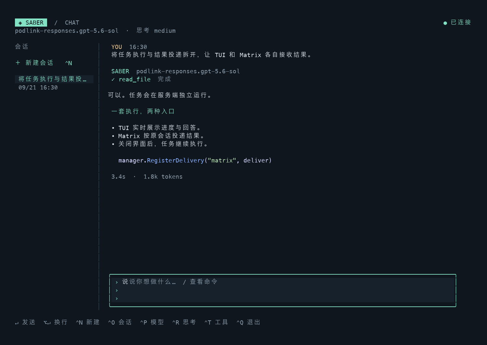
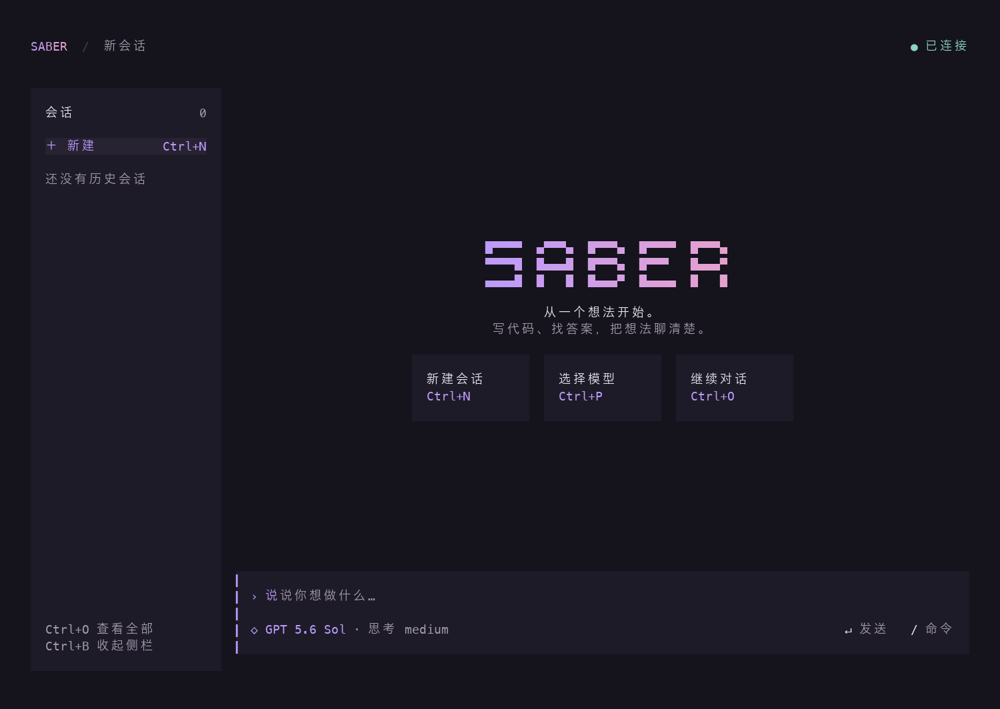

# Saber 终端聊天

Saber 默认运行常驻服务，`saber chat` 是独立的 Charm TUI 客户端。Matrix 是可选聊天入口，两者共用 Agent 和任务执行能力。



界面参考 [Crush 的终端视觉实现](https://github.com/charmbracelet/crush/tree/cc4ae31/internal/ui)：深紫灰底色、渐变字标与薄荷绿回答标记。会话列表、用户消息和工具摘要用柔和底色区分，输入区和选择器不使用整圈描边；输入焦点仅用左侧色条表示。



## 启动

```bash
make build

# 终端一：常驻服务（也可以使用 ./bin/saber serve）
./bin/saber

# 终端二：打开聊天界面
./bin/saber chat

# 配置文件不在当前目录时，两端使用同一个配置路径
./bin/saber serve -c /path/to/config.yaml
./bin/saber chat -c /path/to/config.yaml

# 继续指定会话；也可以在界面内按 Ctrl+O 选择
./bin/saber chat --session <会话编号>
```

默认配置：

```yaml
server:
  listen: "127.0.0.1:8320"
  token_file: ".saber-token"
platforms:
  matrix:
    enabled: false
```

服务端首次启动在配置文件目录创建 `.saber-token`，权限为 `0600`。TUI 使用该令牌连接；模型密钥和执行权限由服务端管理。当前 HTTP 入口仅允许回环地址；多个配置需要使用独立的数据目录和监听端口。

TUI 可通过 `--server http://127.0.0.1:8320` 覆盖连接地址，也可使用仅含 `server` 设置的客户端配置。客户端配置中的 `token_file` 应指向服务端生成的令牌文件。普通日志留在服务端终端，避免破坏 TUI 排版。

## 交互

| 操作 | 快捷键 / 命令 |
|---|---|
| 发送消息 | Enter |
| 输入换行 | Alt+Enter / Ctrl+J；支持增强键盘协议的终端也可用 Shift+Enter |
| 新建会话 | Ctrl+N / `/new` |
| 切换历史会话 | Ctrl+O / `/sessions` |
| 收起或展开会话侧栏 | Ctrl+B / `/sidebar` |
| 选择模型 | Ctrl+P / `/model` |
| 选择思考等级 | Ctrl+R / `/reasoning` |
| 设置其他模型支持的思考等级 | `/reasoning <等级>` |
| 恢复模型默认思考等级 | `/reasoning default` |
| 展开工具参数和结果 | Ctrl+T / `/tools` |
| 查看历史 | PageUp / PageDown / 鼠标滚轮 |
| 跳到历史开头 / 最新内容 | Ctrl+Home / Ctrl+End |
| 刷新连接与会话 | F5 |
| 命令菜单 | 空输入区按 `/`，↑↓ 选择、Enter 执行 |
| 帮助 | `/help` |
| 停止当前任务 | Esc；菜单打开时先返回，会话和输入草稿保留 |
| 清空输入框 | 有输入时 Ctrl+C；菜单打开时先清空并关闭菜单，任务继续运行 |
| 退出界面 | 输入为空时 Ctrl+C；也可使用 Ctrl+Q / `/quit` |

默认配置及任务预算见 [配置说明](configuration.md)。`agent.stream: false` 时等待完整回答后展示正文。

模型和思考等级选择只影响后续消息，不改写配置，也不改变已运行任务。可用思考等级由上游模型决定；选择器提供常见值，不代表所有模型都支持。状态栏显示当前生效值。

宽窗口显示会话侧栏，小于 108 列时收起；Ctrl+B 可手动切换，偏好在本次运行内保留。历史选择始终可以通过 Ctrl+O 打开。正文与输入区最多占 108 列，超宽窗口增加两侧留白。

输入区从一行开始，随换行和自动折行增高，最多显示六行；更长的内容在输入区内部滚动，小窗口会进一步压缩输入高度。当前模型短名称和思考等级位于输入区内的底行，右侧只显示发送与命令入口，运行时切换为停止操作；窄屏自动分行。选择器打开时隐藏这些输入操作提示，重要通知仍保留在输入区下方。历史回答末尾显示该轮模型、用量和耗时，常用操作及换行提示见 `/help`。

回答区支持 Markdown、代码高亮与工具状态。工具内容默认折叠；展开时界面最多显示每项前 4000 字符，持久化记录保留完整的受限工具输出。窗口至少需要 36×14。

选择器覆盖在对话上方，输入文字可按名称或完整标识筛选，↑↓ 选择、Enter 确认、Esc 返回；打开和关闭选择器会保留输入草稿和历史阅读位置。工具折叠时显示路径、命令或查询等参数摘要。向上翻阅时新内容不会自动拉回底部，提示出现后可用 Ctrl+End 回到最新回答。

空输入区键入 `/` 会立即弹出命令菜单，无需先按 Enter。可用方向键选择，也可继续输入命令名称筛选；`/reasoning high` 等带参数命令仍可直接输入并按 Enter 执行。Esc 将已输入的命令放回输入区继续编辑；搜索为空时 Backspace 关闭菜单。正文、路径、网址中的 `/` 和粘贴内容不会触发弹窗。

## 任务与投递

- 服务端统一持有 `tasks.db`，TUI 不直接访问数据库。
- 消息使用稳定请求 ID 去重；网络错误保留输入，再次发送相同输入会复用请求 ID。
- 同一会话一次执行一轮，后续消息接上原始消息和工具轨迹。执行工作区仍按既有任务规则互斥。
- TUI 订阅持久化事件，自动携带游标重连。退出、切换会话、关闭终端均不取消任务；Esc 在聊天界面发送取消请求。Ctrl+C 有输入时清空，输入为空且没有打开菜单时退出；运行中的服务端任务继续执行。空闲时按 Esc 保留当前会话和草稿。
- Matrix 单独注册终态投递器，保留原有重试和文件投递。没有订阅者或 Matrix 投递失败，不会重新执行任务。
- 服务重启将原先运行中的任务标记为中断，不盲目重放有副作用的工具。历史界面展示最近 100 轮、最近 50 个会话，原始记录仍保留在任务数据库中；实际模型输入按 `agent.context` 预算裁剪。
- 工具权限沿用服务端配置，不因 TUI 来自本机而自动授予。终端身份为 `platform: terminal`、`account: saber`、`sender_id: <服务进程 UID>`，会话标识为界面生成的会话 ID。

## 验证与预览

```bash
go test -tags goolm ./internal/task ./internal/server ./internal/tui
go test -race -tags goolm ./internal/task ./internal/server ./internal/tui

# 导出真实 View 输出，供终端预览或视觉检查
SABER_TUI_SNAPSHOT_DIR=/tmp/saber-tui-preview \
  go test -tags goolm ./internal/tui -run TestModel_ResponsiveViews -count=1
```

依赖使用 Charm v2：Bubble Tea 2.0.9、Bubbles 2.2.1、Lip Gloss 2.0.6、Glamour 2.0.1。版本在 2026-09-21 按官方最新稳定版本核对并锁定于 `go.mod`。
